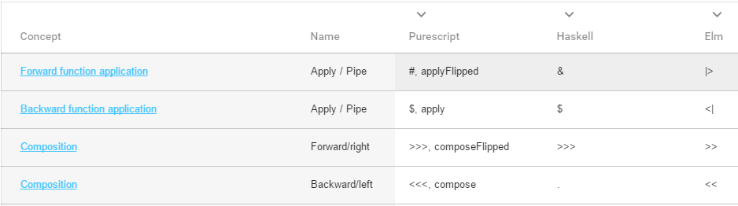

# [Functional programming babelfish](https://hakonrossebo.github.io/functional-programming-babelfish/)

##  [Site is located on Github pages here](https://hakonrossebo.github.io/functional-programming-babelfish/)
Please [contribute](CONTRIBUTE.md) with PR's and issues to help improve this reference.
Any new languages would be very helpful.

This is an attempt to provide a link and comparison between similar concepts and operations and their usage between different functional programming languages . When learning and working with different languages and concepts, it's nice to have an easy way of looking up the implementations. Please contribute! I am not an expert in these languages. Please contribute to improvements with PR's and issues to help improve this reference.
